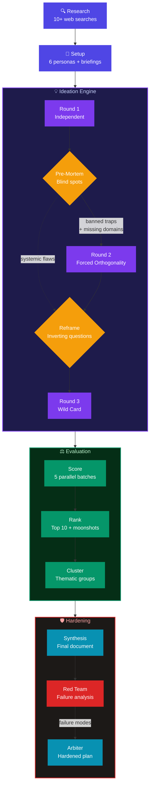

<div align="center">

# Storm

### Multi-Agent Brainstorming for Claude Code

**Turn a single prompt into a researched, debated, red-teamed execution plan.**

[](https://github.com/czemelman/brainstorm)
[](https://github.com/czemelman/brainstorm/releases)
[](LICENSE)

<br>

Storm orchestrates **14 specialized AI agents** across a structured 7-phase pipeline to brainstorm any topic — from product strategy to architecture decisions to naming. It researches, ideates in parallel, eliminates duplicates, scores, ranks, stress-tests with a red team, and delivers a hardened plan you can execute tomorrow.

</div>

---

## The Pipeline



<br>

## Quick Start

```shell
# Add the marketplace
/plugin marketplace add czemelman/brainstorm

# Install the plugin
/plugin install storm@czemelman-tools

# Run your first brainstorm
/storm:start What pricing model should we use for our SaaS product?
```

That's it. Storm handles the rest.

<br>

## What Makes This Different

<table>
<tr>
<td width="50%" valign="top">

### Structured Divergence
Three ideation rounds force genuinely different thinking:
- **Round 1** — Independent ideation (no groupthink)
- **Round 2** — Forced orthogonality (banned convergence traps, mandatory inversions)
- **Round 3** — Wild card (reframing questions that break assumptions)

</td>
<td width="50%" valign="top">

### Built-In Adversarial Review
Every brainstorm gets stress-tested:
- **Pre-mortem agent** identifies blind spots between rounds
- **Red team** performs failure analysis on the final synthesis
- **Executive arbiter** resolves contradictions into a hardened plan

</td>
</tr>
<tr>
<td width="50%" valign="top">

### Parallel Agent Orchestration
Up to 6 persona agents run simultaneously per round, each with differentiated domain briefings. The system generates **60-90+ ideas** across 3 rounds, deduplicates, scores, and ranks globally.

</td>
<td width="50%" valign="top">

### Research-Grounded
Every session starts with 10-20 web searches across the topic domain. Findings are tiered by source quality and routed to specific personas — so agents argue from evidence, not hallucination.

</td>
</tr>
</table>

<br>

## Commands

| Command | Description |
|:--------|:------------|
| `/storm:start` | Start a new brainstorm or resume an existing one |
| `/storm:start --yolo` | Run end-to-end without checkpoints |
| `/storm:start --deep` | Force deep complexity (3 rounds, 6 agents) |
| `/storm:continue` | Resume a paused interactive session |
| `/storm:status` | Show current session state and progress |
| `/storm:reset` | Delete a session after confirmation |

<br>

## Session Modes

<table>
<tr>
<td align="center" width="50%">

### Interactive

Pauses at **3 checkpoints** for user review and steering. Best when you want to guide the direction.

`/storm:start`

</td>
<td align="center" width="50%">

### Yolo

Runs the full pipeline **end-to-end** without stopping. Best for overnight or background runs.

`/storm:start --yolo`

</td>
</tr>
</table>

<br>

## Complexity Levels

| Level | Rounds | Agents | Best For |
|:------|:------:|:------:|:---------|
| **Light** | 1 | 3-4 | Naming, simple choices, quick ideation |
| **Standard** | 2 | 5 | Feature ideation, process improvement |
| **Deep** | 3 | 5-6 | Architecture, strategy, cross-domain problems |

Complexity is auto-detected from your topic, or override with `--light`, `--deep`.

<br>

## Output

Every completed session produces:

```
~/brainstorm-sessions/{session-id}/output/
  synthesis.md                 # Full brainstorm synthesis with top 10 ideas + moonshots
  red_team_memo.md             # Pre-mortem failure analysis
  hardened_execution_plan.md   # Final plan reconciling synthesis with red team
  digest.html                  # Visual HTML digest — open in browser
```

Output is also copied to your current working directory for convenience.

<br>

## Architecture

```
storm/
  commands/          4 slash commands (start, continue, status, reset)
  agents/           14 specialized agents
  instructions/      3 orchestration documents
  scripts/           5 bash scripts for deterministic bookkeeping
```

<details>
<summary><b>Agent Roster (14 agents)</b></summary>
<br>

| Agent | Role | Phase |
|:------|:-----|:------|
| Research | Web research, source tiering, gap analysis | Phase 0 |
| Setup | Problem framing, persona generation, briefings | Phase 1 |
| Persona (x6) | Domain-specific ideation with differentiated briefings | Rounds 1-3 |
| Pre-Mortem | Identifies blind spots and convergence traps | Between R1 and R2 |
| Reframe | Generates inverting questions for wild card round | Before R3 |
| Dedup | Near-duplicate detection on compiled boards | Every round |
| Diversity | Thematic spread assessment and gap identification | Round 1 |
| Scorer | Scores ideas (standard + delusional rubrics) | Evaluation |
| Ranker | Global ranking, moonshot extraction, combinations | Evaluation |
| Clusterer | Groups survivors into thematic clusters | Evaluation |
| Synthesizer | Produces final brainstorm document | Synthesis |
| Red Team | Pre-mortem failure analysis | Red Team |
| Arbiter | Reconciles synthesis with red team findings | Final |
| Checkpoint | Generates summaries at interactive pauses | Checkpoints |

</details>

<br>

## Requirements

- **Claude Code** 1.0.33+ with a plan that supports the Agent tool
- **jq** — `brew install jq` (macOS) or `apt install jq` (Linux)

<br>

## License

MIT

<div align="center">
<br>
<sub>Built with Claude Code</sub>
</div>
