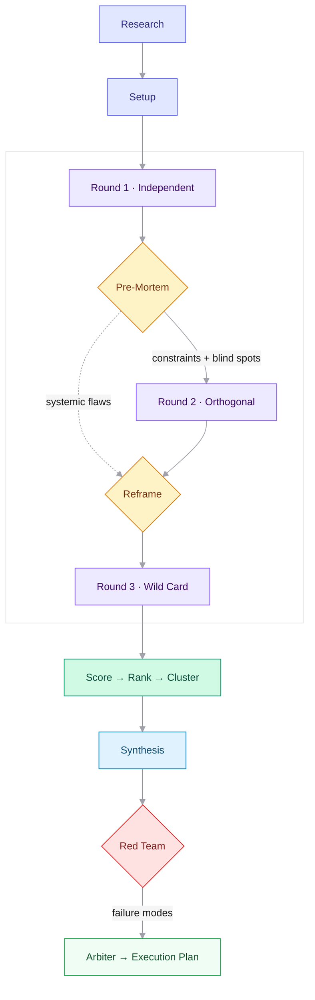

<div align="center">
<br>

# Storm

**Multi-agent brainstorming for Claude Code**

Turn a prompt into a researched, debated, red-teamed execution plan.

<br>

[](#install)
&nbsp;&nbsp;
[](#)
&nbsp;&nbsp;
[](#license)

<br>
</div>

Storm orchestrates 14 AI agents across a structured pipeline — research, three rounds of ideation, scoring, synthesis, adversarial review, and a hardened execution plan. It generates 60-90 ideas, eliminates duplicates, ranks globally, and stress-tests the result before delivering a plan you can act on.

<br>

## Pipeline



<br>

## Install

```shell
/plugin marketplace add czemelman/brainstorm
/plugin install storm@czemelman-tools
```

<br>

## Usage

```shell
/storm:start                                    # Interactive setup
/storm:start What pricing model for our SaaS?   # Direct topic
/storm:start --yolo --deep                      # Full auto, 3 rounds
```

| Command | Purpose |
|:--------|:--------|
| `/storm:start` | New session or resume existing |
| `/storm:continue` | Resume paused interactive session |
| `/storm:status` | Session progress |
| `/storm:reset` | Delete a session |

<br>

## How It Works

<table>
<tr><td width="33%" valign="top">

**Research & Setup**

10-20 web searches grounded in current reality. Findings are tiered by source quality and routed to 6 personas — each gets a differentiated briefing so agents argue from evidence.

</td><td width="33%" valign="top">

**Three-Round Ideation**

Round 1: independent thinking. Pre-mortem finds blind spots. Round 2: forced orthogonality — convergence traps are banned, inversions are mandatory. Reframe generates inverting questions. Round 3: wild cards.

</td><td width="33%" valign="top">

**Evaluate & Harden**

All ideas scored globally, ranked, and clustered. Synthesis extracts the top 10 + moonshots. Red team runs a pre-mortem. Arbiter resolves every contradiction into a hardened execution plan.

</td></tr>
</table>

<br>

## Complexity

| Level | Rounds | Agents | Use case |
|:------|:------:|:------:|:---------|
| Light | 1 | 3–4 | Naming, simple choices |
| Standard | 2 | 5 | Feature ideation, process design |
| Deep | 3 | 5–6 | Architecture, strategy, cross-domain |

Auto-detected from topic. Override with `--light` or `--deep`.

<br>

## Output

```
synthesis.md                  Full synthesis with top 10 + moonshots + combinations
red_team_memo.md              Pre-mortem failure analysis
hardened_execution_plan.md    Final plan reconciling synthesis with red team
digest.html                   Visual HTML digest
```

Sessions stored in `~/brainstorm-sessions/`. Outputs copied to your working directory.

<br>

## Modes

**Interactive** — pauses at 3 checkpoints for steering. Good when you want to guide direction.

**Yolo** (`--yolo`) — runs end-to-end. Good for background or overnight sessions.

<br>

<details>
<summary><b>Agent Roster</b></summary>
<br>

| Agent | Role | When |
|:------|:-----|:-----|
| Research | Web search, source tiering, gap analysis | Phase 0 |
| Setup | Problem framing, persona generation | Phase 1 |
| 6× Persona | Ideation from differentiated perspectives | Each round |
| Pre-Mortem | Blind spots and convergence traps | After Round 1 |
| Reframe | Inverting questions for Round 3 | After Round 2 |
| Dedup | Near-duplicate removal | Every round |
| Diversity | Thematic spread assessment | Round 1 |
| Scorer | Standard + delusional rubrics | Evaluation |
| Ranker | Global ranking, moonshots, combinations | Evaluation |
| Clusterer | Thematic grouping | Evaluation |
| Synthesizer | Final document | Synthesis |
| Red Team | Failure analysis | Hardening |
| Arbiter | Contradiction resolution | Final |

</details>

<br>

## Requirements

- Claude Code 1.0.33+
- `jq` (`brew install jq`)

## License

MIT

<div align="center">
<sub>Built with Claude Code</sub>
</div>
